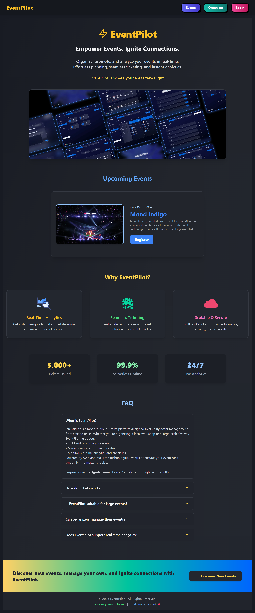

# EventPilot – AWS-Powered Event Management Platform

[](https://nextjs.org/)
[](https://tailwindcss.com/)
[](https://aws.amazon.com/serverless/sam/)
[](https://aws.amazon.com/dynamodb/)
[](https://github.com/nishith-geedh/EventPilot)
[](https://github.com/nishith-geedh/EventPilot/graphs/contributors)
[](LICENSE)
[](https://github.com/nishith-geedh/EventPilot/commits/main)
[](https://github.com/nishith-geedh/EventPilot/issues)
[](https://github.com/nishith-geedh/EventPilot/pulls)
---

A full-stack, production-ready scaffold for organizers and attendees.

**Frontend:** Next.js 14 (App Router), TailwindCSS, NextAuth (Cognito Provider)  
**Backend:** AWS Lambda, API Gateway, DynamoDB, S3, Cognito — orchestrated via AWS SAM

---

## Table of Contents

- [Quick Start](#quick-start)
- [Backend Deployment (AWS SAM)](#deploy-backend-aws-sam)
- [Frontend Setup & Hosting](#configure-frontend)
- [User Roles & Cognito Groups](#roles--users)
- [Organizer Dashboard Features](#organizer-dashboard)
- [Ticketing Flow](#ticketing)
- [Deployment Notes & Manual Steps](#deployment-notes--manual-steps)
- [Commands Reference](#commands)
- [Environment Variables](#environment-variables)
- [Architecture Diagram (ASCII)](#architecture-diagram-ascii)
- [Architecture Diagram (Visual)](#architecture-diagram-visual)
- [Cost & Scalability](#cost--scalability)
- [Screenshots](#screenshots)
- [Contributing](#contributing)
- [License](#license)

---

## Quick Start

### Deploy Backend (AWS SAM)


`cd backend`
`sam build`
`sam deploy --guided`


Pick a stack name (e.g., `eventpilot-stack`).  

On first deploy, SAM will create:

- Cognito User Pool + App Client (Hosted UI optional)
- DynamoDB tables: `Events`, `Registrations`, `Tickets`
- S3 buckets for `banners` & `tickets` (CORS enabled)
- API Gateway with all routes
- Lambda functions for CRUD, analytics, presigned URLs, PDF generation

> **After deployment, note the outputs:**

> - `ApiBaseUrl`
> - `UserPoolId`, `UserPoolClientId`, `UserPoolDomain`
> - `BannersBucket`, `TicketsBucket`
> - `CognitoIssuerUrl`

---

### Configure Frontend

Create `frontend/.env.local` based on `.env.example`, copying SAM output values.

`cd frontend` 
`npm install` 
`npm run dev` # for development 
or
`npm run build && npm start` # for production

Use `& "C:\Program Files\nodejs\npm.cmd" run dev` if `npm` commands show an error.

**Recommended Hosting:**  

AWS Amplify — connect this repo, set environment variables, build & deploy.

---

## Roles & Users

In AWS Console → Cognito → User Pool:

- Create groups: `organizer`, `attendee`
- Assign users appropriately

---

## Organizer Dashboard

Log in as an organizer to access analytics:

- Registrants per event (bar chart)
- Ticket scans over time (line chart)
- Registrations by category (pie chart)
- Conversion metrics (visits vs registrations)
- Real-time active attendees (stub endpoint)

---

## Ticketing Workflow

When an attendee registers:

- Lambda generates a downloadable PDF ticket with embedded QR code
- PDF stored in S3 (`tickets` bucket); attendee receives a pre-signed URL


---

## Deployment Notes & Manual Steps

1. **Cognito Hosted UI (optional):**  
   Set a custom domain (e.g., `eventpilot-xyz`) and callback URLs matching your frontend (`https://yourdomain/callback`). Or, use custom flows via NextAuth.
2. **CORS:**  
   Buckets start with permissive dev CORS; restrict for production.
3. **Stripe (optional):**  
   Add Stripe test/live keys in `.env.local`.  
   Extend the `createRegistration` Lambda for payment handling.

---

## Commands

```bash
# Backend (AWS SAM)
cd backend
sam build && sam deploy --guided
```

```bash
# For subsequent deployments
sam deploy
```

```bash
# Frontend (Local)
cd frontend
npm install
npm run dev
```


**Frontend (Amplify):**
- Connect repo → Set env vars → Build & Deploy

---

## Environment Variables

### Frontend (`frontend/.env.local`)

```env
NEXT_PUBLIC_API_BASE_URL=https://<api-id>.execute-api.<region>.amazonaws.com/Prod
NEXTAUTH_URL=http://localhost:3000
NEXTAUTH_SECRET=replace-with-strong-random

COGNITO_CLIENT_ID=
COGNITO_CLIENT_SECRET=
COGNITO_ISSUER=https://cognito-idp.<region>.amazonaws.com/

NEXT_PUBLIC_BANNERS_BUCKET=
NEXT_PUBLIC_TICKETS_BUCKET=
NEXT_PUBLIC_REGION=

# Optional Stripe test keys
STRIPE_PUBLIC_KEY=pk_test_xxx
STRIPE_SECRET_KEY=sk_test_xxx
```


### Backend (SAM Parameters / Env):

- `BannersBucketName`
- `TicketsBucketName`
- `AllowedOrigin` (CORS for API)
- `EnableHostedUI` (true/false)

---

## Architecture Diagram (ASCII)

<pre>
                  ┌───────────────┐
   ┌─────────────►│  API Gateway  │◄─────────────┐
   │ HTTPS        └─────┬─────────┘    REST API  │
   │                    │                        │
   │    Next.js         ▼                        │
   │ + NextAuth   ┌───────────────┐    Lambda +  │
   │ (Front-End)  │   Lambda FN   │◄──Analytics──┘
   └──────────────┤  (CRUD, PDF,  │
                  │ QR, Auth...)  │
                  └─────────┬─────┘
                            │
                  ┌─────────▼─────────┐
                  │    DynamoDB       │
                  │ (events, users)   │
                  └─────────┬─────────┘
                            │
      ┌─────────────────────▼─────────────────────┐
      │          S3 Buckets                       │
      │     ┌─► banners (uploads)                 │
      │     └─► tickets (PDF/QR, signed URLs)     │
      └───────────────────────────────────────────┘
                            ▲
                 Cognito User Pool + Groups
                       ┌────────────┐
                       │ organizer  │
                       │ attendee   │
                       └────────────┘
</pre>

## Architecture Diagram (Visual)

### 🧱 Overall System Architecture


---

## Cost & Scalability

| Service     | Purpose                   | Pricing                | Scalability         |
|-------------|---------------------------|------------------------|---------------------|
| DynamoDB    | Event/registration store  | On-demand, per-request | Auto-scaled         |
| Lambda      | API/business logic        | Per-invocation         | Scales-to-zero      |
| API Gateway | RESTful API endpoints     | Per-call               | Auto-scaled         |
| S3          | File storage (banners/tickets)| Per-GB + bandwidth  | Durable, low-cost   |
| Cognito     | Auth/groups               | Per MAU                | Handles bursts      |
| Amplify     | Frontend static hosting   | Static + build usage   | Global CDN          |
| Stripe      | Payments (optional)       | Pay-as-you-go          | Secure, scalable    |

_Designed for serverless, scale-to-zero efficiency and clean modular separation._

---
## Screenshots

---

### 🏠 Homepage

  
*Landing page — shared between Organizer and Attendee roles.*

---

### 👥 Attendee Experience

#### 📅 View Events

  
*Ongoing and upcoming events with banners, date, time, and event details.*

#### 🚫 Access Denied

  
*Attendee trying to access the Organizer Dashboard receives an access denied message prompting login.*

#### 🔐 Login with Cognito Prompt

  
*Login screen prompting user to authenticate using Cognito.*

#### 🔐 Cognito Hosted UI

  
*Cognito-hosted login page for secure sign-in.*

#### 📝 Register for an Event

  
*Attendee registers for a specific event by entering name and email, then downloads a ticket.*

#### 🎫 Ticket PDF

  
*Generated ticket PDF showing user name, email, event, ticket ID, and QR code.*

---

### 📊 Organizer Dashboard

#### 📈 Analytics Overview

  
*Dashboard with total registrations, page visits, funnel analytics, conversion rate, active users, and more.*

#### 👥 Registrants Table

  
*List of registrants for an event in a table format, with a button to download CSV.*

#### 📄 Downloaded CSV

  
*CSV file showing registration ID, name, email, timestamp, and user ID.*

#### ⚙️ Manage Events

  
*Page displaying all events with options to view, edit, or delete; includes a Create Event button.*

#### ✏️ Edit Event

  
*Editable fields for title, description, date & time, category, and banner URL.*

#### ➕ Create Event

  
*Form to create a new event with title, description, date & time, category, and optional banner.*


---


## Contributing

Contributions and suggestions are always welcome.  
Open issues or pull requests for features, fixes, or documentation.

---

## License

MIT License. See [LICENSE](LICENSE).

---

**EventPilot** delivers a modern, scalable foundation for AWS-native, production-grade event platforms —  
with robust patterns for cost, security, performance, and developer experience.
